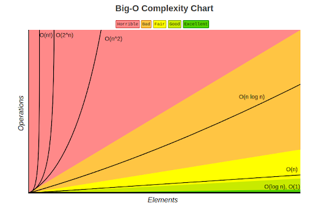

# Time Complexity
- focused on how many time it will executed

## Why do we need Time Complexity?
- Compare Algorithms/DSA Solutions. Which algorithm is faster?
- How to measure its speed?
    - Time taken in seconds?
        - But that would change depending on the input data set size. Also on the machine on which its being run.
    - Number of statements executed?
        - This would depend on the language  and style of the code.
    - How to make it independent of these?
- Time Complexity of an algorithm is the time taken for it to complete its operation as a function of its data input size, n. 
    - Standards - Big O notation (others - Big Theta, Big Omega)
    - Examples - O(1), O(n), O(n^2), O(n logn)

## Time Complexity Examples
1. You have ‘n’ books and you go through each of them to find the one you’re looking for
    - O(n)
    - Does this definition change if `n` changes?
2. 
```JavaScript
function Sum(a, b) {
    let c=0;
    C = a+b;
    return c;  
}
```
- 2 units of time(constant). One for the arithmetic operation and one for the return - O(1)
3. 
```JavaScript
function main(n=100) {
    for (let i = 1; i <= n; i++) {
        console.log("Hello World!\n");
    }
}
```
- Loop executes n number of times, thus O(n)

# Space Complexity
- focused on how many new variable will be created or an element being pushed into an array/object etc.
- Algorithm also uses memory to store data for its operations
- Which algorithm takes less space (desired)?
- How would you measure their memory usage?
    - Compare memory used by different algorithms, for same input?
        - Not possible to test for all  inputs. Also, this depends on compiler, language, machine etc.
    - How to make it generic across all inputs?
- Space Complexity of an algorithm is the amount of memory needed for its operation as a function of its data input size, n.
    - Standards - Big O notation
    - This space includes the inputs as well as additional space used by variables and DS

## Space Complexity Examples
1. 
```JavaScript
function Sum(a, b) {
    return a+b;  
}
```
- Three integers used here - a, b and the result. But this is constant - O(1).
2. 
```JavaScript
function sumArray(arr) {
    int size = arr.length; //size of arr
    int sum = 0;
    for (let iterator = 0; iterator < size; iterator++) {
        sum += arr[iterator];
    }
    return sum;
}
```
- array – the argument – space taken is equal to 4n bytes, n is length of array. Since this is input and is not space allocated by this function, it is not considered.
- size – a 4-byte integer, sum – a 4-byte integer, iterator – a 4-byte integer
- Total space needed is 4 + 4 + 4 (bytes). This is constant space. Thus, space complexity is O(1).

# Big-Oh O()
- Big-oh O() -> tells us the complexity based on input given
- Way to measure how well our algorithm scales as the amount of data increases
    - Example: Input set of 10 elements compared to input set of million elements
    - Example: What has the biggest effect on the answer in this equation? → 2*n^3 + 5*n^2 + 19 
        - When n = 2, the answer is 2*8 + 5*4 + 19 = 55
        - When n = 3, the answer is 2*27 + 5*9 + 19 = 118
        - When n = 10, the answer is 2*1000 + 5*100 + 19 = 2519
        - 19 is insignificant as n increases
        - In fact, n^2 is also dwarfed by n^3 as n increases
        - n^3 is the main contributor (even the constant, 2, doesn’t contribute much)
        - Hence, the complexity of this equation is O(n^3)

## Visualisation of Common Big O Complexities
- Applies to both Space and Time Complexities
- Think very large n, to realize why O(1) is so much better than O(n) or why O(n) is so much better than O(n^2), etc.
- Can you arrange these in increasing order?
    - O(1), O(log n), O(n), O(n logn), O(n^2), O(2^n), O(n!)
        - O(1) = O(yeah)
        - O(log n) = O(nice)
        - O(n) = O(ok)
        - O(n²) = O(my)
        - O(2ⁿ) = O(no)
        - O(n!) = O(mg!)


# Trade off between Time and Space
- Algorithms use Memory and need Time to complete
- In most cases, we can have trade off between Space and Time i.e. we can solve a problem
    - Either in less time by using more memory 
    - Or using less memory but spending more time
- The choice depends on the constraints of a problems.
    - **Example 1** - Merge Sort algorithm is exceedingly fast but requires a lot of space to do the operations. At the other end, Bubble Sort is exceedingly slow but requires the least space.
    - **Example 2** - We can store already calculated results in some recursion problems, instead of calculating them multiple  times. (Example: Fibonacci problem)

# Activities
## Activity 1
```JavaScript
function searchForValue(valueToFind, arr) {       
       let sizeOfArray = arr.length 
for (var it = 0; it < sizeOfArray ; it++) {
            if (arr[it] == valueToFind) {
                console.log("Success");
                break;
            }
        }
        if (it == sizeOfArray)
            console.log("Failure");
        return;
}
```
- **Time Complexity - O(n)** - Linear Search, grows directly in proportion to the input data size
- **Space Complexity - O(1)** - No size specific data structure used
- Other examples of O(n)
    - Get the max/min value in an array.
    - Find a given element in a collection. (What happens if this is sorted?)
    - Print all the values in a list.
    - Every time a list or array gets iterated over, it is most likely in O(n) time.

## Activity 2
```JavaScript
function findCommonElements(arr1, arr2) {
  const commonElements = [];
  
  for (let i = 0; i < arr1.length; i++) {
    for (let j = 0; j < arr2.length; j++) {
      if (arr1[i] === arr2[j]) {
        commonElements.push(arr1[i]);
        break;
      }
    }
  } 
  return commonElements;
}
```
- **Time Complexity - O(n*m)** - Running 2 loops but each one iterates to a different length
- **Space Complexity - O(min(n,m))** 

## Activity 3
```JavaScript
for (i = 0; i < N; i++) {
    sequence of statements
}
for (j = 0; j < M; j++) {
    sequence of statements
}
```
- **Time Complexity - O(n + m)** - Running 2 loops but they are not nested
- **Space Complexity - O(1)** - constant number of variables

## Activity 4
```JavaScript
for(int i = 0; i < n; i++){
    for(int j = 0; j <= i; j++){
       print(i, j);
  }
}
```
- **Time Complexity - O(n*n)**
- **Space Complexity - O(1)** - constant number of variables

## Activity 5
```JavaScript
for(int i = 0; i < a; i++) {
    for(int j = 0; j <= b; j++) {
        for(int k = 0; k <= c; k++) {
		print(i, j, k)
	   }
    }
}
```
- **Time Complexity - O(a*b*c)** - Running 3 nested loops
- **Space Complexity - O(1)** - constant number of variables
- Always express complexity in terms of the variable given in the problem